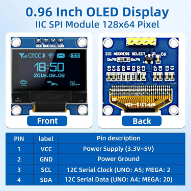

# I2C 0.96" OLED display with SSD1306 controller

>[!TIP]
> Needs the following Arduino Libraries:
> - Wire
> - SPI
> - Adafruit_GFX_Library
> - Adafruit_SSD1306
> - Adafruit_BusIO
>

 Picture of display 

  

>[!NOTE]
> Good tutorial on [Random Nerd Tutorials](https://randomnerdtutorials.com/guide-for-oled-display-with-arduino/)
